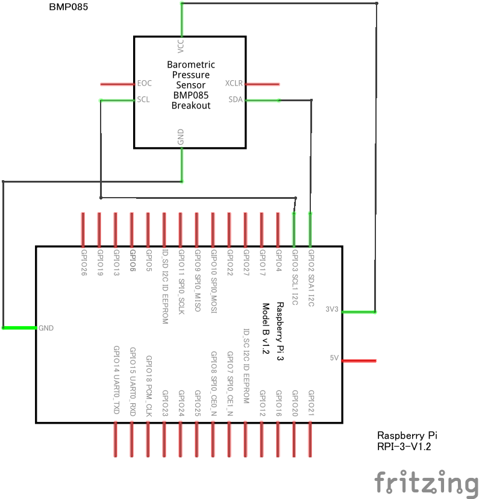

# BMP085 class

Raspberry Piに廃番の`BMP085`を繋いで使用するための仲立ちをします。
`smbus2`を使用しているため、存在しない場合はインストールします。
`python3`なので`pip3`を用いています。

``` bash
pip3 install smbus2
```

## プログラム

`bmp085.py`は[data sheet](https://www.sparkfun.com/datasheets/Components/General/BST-BMP085-DS000-05.pdf)の記述をPythonに書き起こしたものです。
日本語で平易に註を付したものは此方になります。
爰に、邦訳の見当が付かなかった語は次のように訳しています。

|英|倭|
|:-:|:-:|
|Calibration Coefficients|校正変数|
|Uncompensated Temperature|無補償温度|
|Uncompensated Pressure|無補償気圧|

``` Python
import time
from smbus2 import SMBus

class BMP085:
# 変数
    # データを蒐集するリスト
    lReadData = []
    # 最初に訪ねるアドレス
    iAddress = 0xAA
    # 校正変数を纏める辞書
    dictCCs: dict = {
        "iAC1": 0, "iAC2": 0, "iAC3": 0, "iAC4": 0, "iAC5": 0, "iAC6": 0,
        "iB1": 0, "iB2": 0, "iB3": 0, "iB4": 0, "iB5": 0, "iB6": 0, "iB7": 0,
        "iMB": 0, "iMC": 0, "iMD": 0
    }

# 関数
    # 初期化
    def __init__(self, i2cChannel, slaveAddress) -> None:
        # I²Cチャンネル
        self.iI2CChannel = i2cChannel
        # I²Cチャンネルに基づきSMBusを設定する
        self.i2c = SMBus(bus = self.iI2CChannel)
        # スレイブアドレス、I²Cアドレス
        self.iSlaveAddress = slaveAddress

    # メモリーから数値を取得する
    def getNewData(self):
        # 初動位置：0xAA
        # 終端位置：0xBF
        while self.iAddress <= 0xBF:
            lData = self.i2c.read_i2c_block_data(
                i2c_addr = self.iSlaveAddress,
                register = self.iAddress,
                length = 1
            )

            '''
            負数判定
            符号付き変数の値を表すデータであり且つMSB(2バイト中の上1バイト)の値は
            負数か否かを考慮する

            AC4, AC5, AC6は符号なし変数であるため除外する

            偶数アドレスならば上1バイト
            奇数アドレスならば下1バイトである

            符号ありの値が127を超えていれば、負数を表している
            256を引くことで、正しい値になる
            '''
            if ((self.iAddress < 0xB0 or self.iAddress > 0xB5) and self.iAddress % 2 == 0):
                if (lData[0] > 127):
                    lData[0] -= 256

            # 得られたデータを保持しておく
            self.lReadData.append(lData[0])

            # 次のアドレスを取る
            self.iAddress += 0x01
        # 得られたデータで計算する
        self.__calculateCalibrationCoefficients()

    # 校正変数を計算する
    def __calculateCalibrationCoefficients(self):
        '''
        data sheet儘
        上1バイト(MSB)に下1バイト(LSB)を接ぐため、
        MSBを8ビットだけ上位方向に移動する
        '''
        self.dictCCs["iAC1"] = (self.lReadData[0] << 8) + self.lReadData[1]
        self.dictCCs["iAC2"] = (self.lReadData[2] << 8) + self.lReadData[3]
        self.dictCCs["iAC3"] = (self.lReadData[4] << 8) + self.lReadData[5]
        self.dictCCs["iAC4"] = (self.lReadData[6] << 8) + self.lReadData[7]
        self.dictCCs["iAC5"] = (self.lReadData[8] << 8) + self.lReadData[9]
        self.dictCCs["iAC6"] = (self.lReadData[10] << 8) + self.lReadData[11]
        self.dictCCs["iB1"] = (self.lReadData[12] << 8) + self.lReadData[13]
        self.dictCCs["iB2"] = (self.lReadData[14] << 8) + self.lReadData[15]
        self.dictCCs["iMB"] = (self.lReadData[16] << 8) + self.lReadData[17]
        self.dictCCs["iMC"] = (self.lReadData[18] << 8) + self.lReadData[19]
        self.dictCCs["iMD"] = (self.lReadData[20] << 8) + self.lReadData[21]

    # 無補償温度値を取得する
    def __getUncompensatedTemperature(self):
        # メモリーに命令を書き込む
        self.i2c.write_byte_data(
            i2c_addr = self.iSlaveAddress,
            register = 0xF4,
            value = 0x2E
        )

        # 4.5ms待機する
        time.sleep(0.0045)

        # メモリーから数値を取得する
        iMSB_UT = self.i2c.read_i2c_block_data(
            i2c_addr = self.iSlaveAddress,
            register = 0xF6,
            length = 1
        )[0] # リストで得られるため、リストの中を取り出す
        iLSB_UT = self.i2c.read_i2c_block_data(
            i2c_addr = self.iSlaveAddress,
            register = 0xF7,
            length = 1
        )[0] # リストで得られるため、リストの中を取り出す

        # 数値を接合し、無補償温度値を得る
        iUT = (iMSB_UT << 8) + iLSB_UT

        return iUT

    # 実温度(℃)を計算する
    def getTemprature(self):
        # 無補償温度値
        iUT = self.__getUncompensatedTemperature()

        # data sheet儘
        X1 = int(((iUT - self.dictCCs["iAC6"]) * self.dictCCs["iAC5"]) >> 15)
        X2 = int((self.dictCCs["iMC"] << 11) / (X1 + self.dictCCs["iMD"]))
        self.dictCCs["iB5"] = X1 + X2

        # 実温度
        fTemperature = int((self.dictCCs["iB5"] + 8) >> 4) / 10

        return fTemperature

    # 無補償気圧値を取得する
    def __getUncompensatedPressure(self):
        # ノイズデータ
        self.iSetting = 0
        '''
        data sheetより
        0: ultralow power mode
        1: standard mode
        2: high resolution mode
        3: ultra high mode
        '''

        # メモリーに命令を書き込む
        self.i2c.write_byte_data(
            i2c_addr = self.iSlaveAddress,
            register = 0xF4,
            value = 0x34 + (self.iSetting << 6)
        )

        # 4.5ms待機する
        time.sleep(0.0045)

        # メモリーから数値を取得する
        iMSB_UP = self.i2c.read_i2c_block_data(
            i2c_addr = self.iSlaveAddress,
            register = 0xF6,
            length = 1
        )[0] # リストで得られるため、リストの中を取り出す
        iLSB_UP = self.i2c.read_i2c_block_data(
            i2c_addr = self.iSlaveAddress,
            register = 0xF7,
            length = 1
        )[0] # リストで得られるため、リストの中を取り出す
        iXLSB_UP = self.i2c.read_i2c_block_data(
            i2c_addr = self.iSlaveAddress,
            register = 0xF8,
            length = 1
        )[0] # リストで得られるため、リストの中を取り出す

        # 数値を計算し、無補償気圧値を得る
        iUP = (((iMSB_UP << 16) + (iLSB_UP << 8) + iXLSB_UP) >> (8 - self.iSetting))

        return iUP

    # 実気圧(hPa)を計算する
    def getPressure(self):
        # 無補償気圧値
        iUP = self.__getUncompensatedPressure()

        # data sheet儘
        self.dictCCs["iB6"] = (self.dictCCs["iB5"] - 4000)
        X1 = int((self.dictCCs["iB2"] * (self.dictCCs["iB6"] * self.dictCCs["iB6"] >> 12)) >> 11)
        X2 = int((self.dictCCs["iAC2"] * self.dictCCs["iB6"]) >> 11)
        X3 = X1 + X2
        self.dictCCs["iB3"] = int((((self.dictCCs["iAC1"] * 4 + X3) << self.iSetting) + 2) / 4)

        X1 = int((self.dictCCs["iAC3"] * self.dictCCs["iB6"]) >> 13)
        X2 = int((self.dictCCs["iB1"] * ((self.dictCCs["iB6"] * self.dictCCs["iB6"]) >> 12)) >> 16)
        X3 = int((X1 + X2 + 2) >> 2)
        self.dictCCs["iB4"] = int(self.dictCCs["iAC4"] * (X3+32768 ) >> 15)
        self.dictCCs["iB7"] = int((iUP - self.dictCCs["iB3"]) * (50000 >> self.iSetting))

        if self.dictCCs["iB7"] < 0x80000000:
            iPressure = int((self.dictCCs["iB7"] * 2) / self.dictCCs["iB4"])
        else:
            iPressure = int((self.dictCCs["iB7"] / self.dictCCs["iB4"]) * 2)

        X1 = int((iPressure >> 8) ** 2)
        X1 = int((X1 * 3038) >> 16)
        X2 = int((- 7357 * iPressure) >> 16)

        # 実気圧
        iPressure += int((X1 + X2 + 3791) >> 4)

        # [㎩] → [h㎩]
        return iPressure / 100.0
```

## 回路

`example.py`では次のように配線しています。



## 簡単な応用例

「[これ1冊でできる！ラズベリー･パイ 超入門 改訂第7版 Raspberry Pi 1+/2/3/4/400/Zero/Zero W/Zero 2 W 対応](http://www.sotechsha.co.jp/pc/html/1297.htm)」の付録である`so1602.py`を用いたプログラムです。
有機ELディスプレイに温度と気圧を表示する拙いものです。

`slave address`は端末から調べることができます。
Raspberry Piの`I²C channel`は通常`1`であることから、本例でも`1`としています。

``` bash
i2cdetect 1
```

得られた結果が次の通りであったため、プログラムにも同内容を記述しています。

|機器名|slave address|
|:-:|:-:|
|bmp085|0x77|
|so1602|0x3c|

``` Python
from bmp085 import BMP085
from so1602 import so1602
import time

iI2CChannel = 1
iSlaveAddressBMP085 = 0x77
iSlaveAddressSO1602 = 0x3c

# センサー
sensor = BMP085(
    i2cChannel = 1,
    slaveAddress = iSlaveAddressBMP085
)
# 有機EL
display = so1602(
    ch = iI2CChannel,
    ad = iSlaveAddressSO1602
)
# ディスプレイを初期化
# ホームポジション
display.move_home()
# カーソルを表示しない
display.set_cursol(0)
# カーソルを点滅しない
display.set_blink(0)

while True:
    # データを取得する
    sensor.getNewData()
    
    # 温度を取得する
    temprature = sensor.getTemprature()

    # 気圧を取得する
    pressure = sensor.getPressure()

    # 表示する
    display.write(
        "{} degree(C)"
        .format(temprature)
    )
    # 改行
    display.move(0x00, 0x01)
    display.write(
        "{} hPa"
        .format(pressure)
    )

    # 10秒待機する
    time.sleep(10)

    # ホームポジション
    display.move_home()
```
