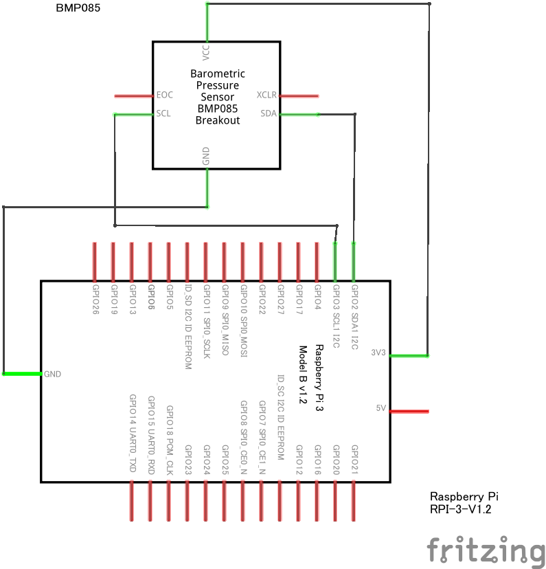

# BMP085_Python_Module

Python module for easy using BMP085 with Raspberry Pi.
This module is importing `smbus2`.
If you haven't installed it:

``` bash
pip3 install smbus2
```

## about source code

Source file is just copy of [data sheet](https://www.sparkfun.com/datasheets/Components/General/BST-BMP085-DS000-05.pdf).
See that sheet if you want to know about calculating, coefficients, etc.
Or you can make it yourself.

## about circuit

In `example.py`, I wired as this:


